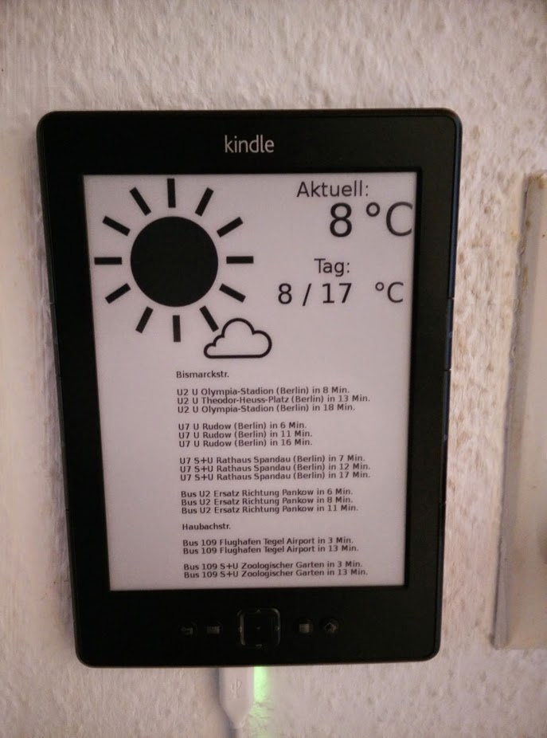

Weather display functionality inspired by 
http://www.mpetroff.net/archives/2012/09/14/kindle-weather-display/

I added a section for depture times of Busses, Tram and Subway (using BVG-grabber api).

Please note, that this was just an excercise for me, to introduce myself into Python and that my goal was not to write beautiful code, but rather something that works and fulfills my personal usecase.  